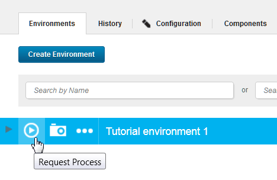
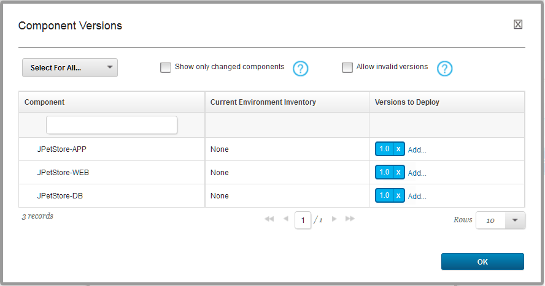

# Lesson 5: Deploying the application components

To deploy the components in the application, run the application process on the new environment.

Now that you have an environment and all the necessary processes, you can deploy the components by running the application process.

1.  Open the application page by clicking **Applications** and then clicking the application name.
2.  In the same row as your environment, click the **Request Process**  icon, as shown in the following figure.

    

3.  In the Run Process window, in the **Process** list, select the `Deploy JPetStore` process
4.  Next to **Versions**, click **Choose Versions**.
5.  In the Component Versions window, at the top left, click **Select For All** \> **Latest Available**.Make sure that version 1.0 is selected for each component, as shown in the following figure:

    

    You must select a version for each component; if you do not select a version, that component is not deployed.

6.  Click **OK**.
7.  Click **Submit**.

The web page shows you the progress of the application process request. From this page, you can watch as the processes run. The following figure the application process partially completed. The application component process is finished and the other two component processes are running.


If the process runs successfully, the request shows that each component process is finished, as in the following figure:


In this case, you can view the running application at the following URL, by substituting the host name of your target system for hostname. This is the host name of the agent that you configured in [Configuring the agent and target system](webapp_configure_agent.md). In the URL, specify the tomcat.contextroot value that you entered for this environment after the port number.

```
http://hostname:8081/JPetStoreDev
```

The application shows a simple online shopping site in the form of a pet store. The following figure shows the home page:


From the home page, click **Enter the Store** and then browse the items that are available, as shown in the following figure:


If the application process did not run successfully, one of the component processes might have failed. In this case, the process is listed with a status of `Failed`. To troubleshoot this failed process, expand the log section for the component, and find the step that failed:


From here, you can look at the command-line output log for each step in the process by clicking the **Output Log**  icon.

If one of your component processes did not complete, identify the step that did not complete. Verify that the properties for that step are correct and that the steps are in the correct order in the process. Then, run the application process again.

**Note:** If you run the application process again, be sure to clear the **Only Changed Versions** check box and select the versions of each component. If you leave this check box selected, the server runs the component processes only for components that have new versions.


This application process installed each of the components in the application by running their component processes.

Application processes can also uninstall or update components or run other configuration tasks for the application and its components.

**Parent topic:** [Deploying a simple web application](../../com.ibm.udeploy.tutorial.doc/topics/webapp_abstract.md)

