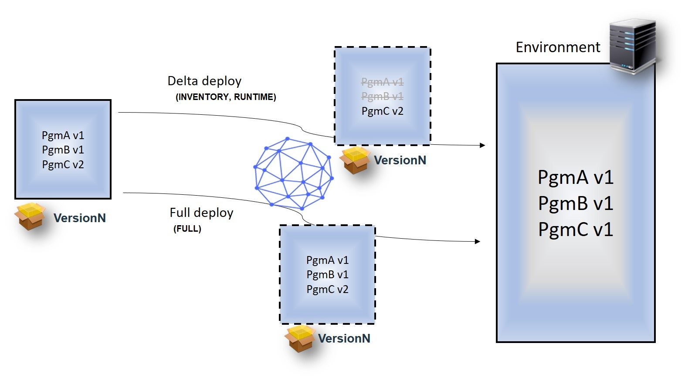

# Deploying components to the z/OS platform

Use the toolkit to deploy to the IBM® z/OS® platform.

Deploying components to the IBM z/OS platform is similar to deploying to other platforms. Create an application, components, environments, and resources. Import versions of artifacts to the components, and then create an application process that deploys the components to a target environment.

When you create a component for z/OS artifacts, select **z/OS** as the component type.

Versions can be imported to a z/OS component by using the zOS File source configuration plug-in or by using the buztool command line from an z/OS agent.

Two or more z/OS component versions can also be merged from a snapshot into one to simplify the deployment to the next environment. Refer to [Merging z/OS component versions](zos_merge_comp.md#).

In your application process with the components to deploy, configure the **Deploy Data Set** process step as either a **FULL**, **INVENTORY**, or **RUNTIME** deployment for z/OS data sets and HFS files.

A **FULL** deployment type replaces all artifacts with artifacts in the current component version.

An **INVENTORY** deployment type, or delta deployment, reduces deployment time significantly by deploying only the changes between artifacts.

A **RUNTIME** deployment type is a delta deployment that uses checksum logic to compare artifacts to be deployed with the same artifacts in the target environment. This check is done for every artifact. Only artifacts with checksums that don't match are considered as changed and used for deployment.

**Note:** Two artifacts are considered the same when at least one attribute can be used for comparison and all attributes that are used for comparison match exactly.

For each artifact in a delta deployment, the following attributes are compared to the latest inventory version of the same artifact.

|**Parameter**|**Where Used**|**Description**|
|-------------|--------------|---------------|
|Last Modified Timestamp|**INTENTORY****RUNTIME**| UrbanCode Deploy reads the Last Modified Timestamp value when the version is packaged.

 All load modules that are build by RTC have Last Modified Timestamp values stored in SSI.

 If SSI has no Last Modified Timestamp values, UrbanCode Deploy tries to read ZLM4DATE, ZLMTIME and ZLMSEC statistical values from ISPF.

 Note that the JCL-built or third-party tool load modules will likely have a Last Modified Timestamp value of NO.

 |
|Custom properties starting with SYS.id \(aka identification properties\)|**INVENTORY****RUNTIME**| These properties provide an open framework for the customer or provider to add additional attributes to indicate whether two artifacts are the same. For example, with these properties you can add hash or binder information in the future.

 Two artifacts are considered the same when all attributes that are used for comparison match exactly.

 |
|checksum|**RUNTIME**| UrbanCode Deploy determines the checksum value when the version is packaged.

 During a **RUNTIME** deployment, the checksum is calculated for the artifact in the target environment and compared with the checksum calculated during the version creation.

 |

1.   Install the z/OS agent. See [Installing the z/OS agent](../../com.udeploy.install.doc/topics/zos_installing_ov.md#). 
2.  Create a ship list file.See [Ship list files](zos_shiplistfiles.md).
3.  Create a deployable component version.See [Creating z/OS component versions](zos_runtools.md).
4.   Create component processes and application processes as you would for any other deployment, by using the z/OS Utility plug-in for process steps that retrieve and deploy z/OS artifacts. For example, use Download Artifacts for z/OS process steps to retrieve z/OS artifacts. Configure the Deploy Data Set process step for either a **FULL**, **INVENTORY** or **RUNTIME** deployment of the z/OS data sets and HFS files. The z/OS Utility plug-in also includes process steps for rolling back data sets, for running commands from the time sharing option \(TSO\) command line, and for running ISPF commands. To learn more about the z/OS Utility plug-in, see the HCL UrbanCode Deploy [plug-in site](http://developer.ibm.com/urbancode/plugins/ibm-urbancode-deploy/). For best results, create components by using the MVSCOMPONENT template which has built-in deploy processes.

-   **[Ship list files](../topics/zos_shiplistfiles.md)**  
The ship list file describes the files from the build to include in the new component version to deploy. Ship list files can also use generic artifacts to describe changes that are not physical files, such as configuration changes.
-   **[Searching the z/OS environment inventory](../topics/zos_search_inventory.md)**  
The z/OS search feature is available for any application that contains a z/OS type component. Search is performed for a specific file in the artifacts belonging to the z/OS components deployed to that environment.
-   **[Creating z/OS component versions](../topics/zos_runtools.md)**  
You can create z/OS component version by running the buztool.sh command from job control language \(JCL\) or from the z/OS UNIX System Services command line. You can also create z/OS component version by using the z/OS File Source Config plug-in.

**Parent topic:** [z/OS considerations for UrbanCode Deploy](../topics/zos_ch.md)

