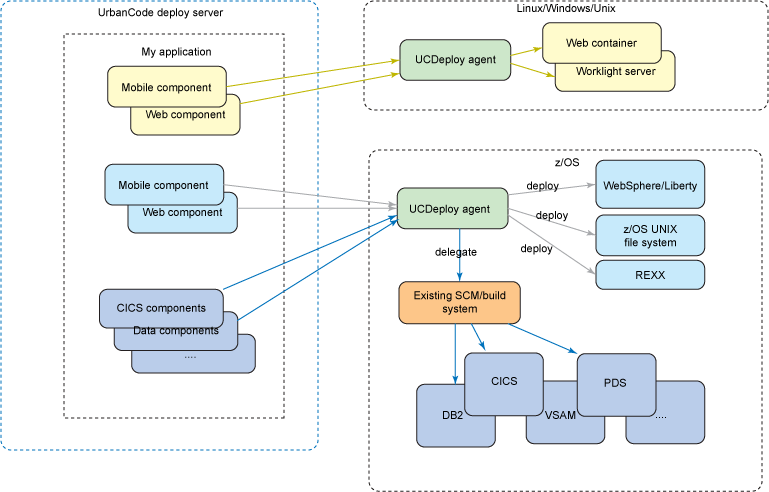

# z/OS considerations for UrbanCode Deploy

UrbanCode Deploy includes support for the z/OS platform. Although the articles in this Knowledge Center for using UrbanCode Deploy to deploy applications, certain platform-specific configuration factors must be considered when using a z/OS model.

An example of a standard enterprise application topology for the z/OS platform is shown. The z/OS components run on CICS with virtual storage access method \(VSAM\) for the data source. Some of the web and mobile components also run on z/OS using an application platform such as IBM WebSphere for z/OS. Some components run on distributed platforms.

  

These characteristics require the following considerations, as detailed in these areas of UrbanCode Deploy.

-   **[Installing the z/OS agent](../../com.udeploy.install.doc/topics/zos_installing_ov.md)**  
Before you deploy to the IBM® z/OS® platform, you must install the z/OS® agent and configure the z/OS® server for communication with HCL® UrbanCode™ Deploy. If the build process runs on a different logical partition \(LPAR\), then you must additionally install the agent on the build LPAR. You can install the z/OS® agent and deployment tools by using the IBM® System Modification Program Extended \(SMP/E\) or by extracting archive files to the z/OS® UNIX™ file system.
-   **[Upgrading IBM z/OS agents](../../com.udeploy.install.doc/topics/upgrade_zOS_agents.md)**  
You can upgrade IBM® z/OS® agents. However, you must upgrade the server before you upgrade the agents.
-   **[Starting z/OS agents from the z/OS UNIX command line](../../com.udeploy.install.doc/topics/zos_start_agent.md)**  
 The UCD z/OS agent can be started from ISPF as a started task or from the z/OS UNIX command line. To start an agent from ISPF as a started task refer to [Starting agents](../../com.udeploy.install.doc/topics/run_agent.md). To start the z/OS agent from the z/OS UNIX command line, follow this procedure.
-   **[Deploying to the z/OS platform](../topics/deploying_zos.md)**  
Use the toolkit to deploy to the IBM® z/OS® platform.
-   **[Security requirements on IBM z/OS computers](../../com.udeploy.admin.doc/topics/security_zos.md)**  
Specific security definitions are used to secure HCL® UrbanCode™ Deploy \(UCD\) functions for the IBM® z/OS® environment. To deploy applications to an IBM® z/OS® environment, the user accounts on the agent computer must have adequate access permissions. You must also identify specific directories and data sets to the authorized program facility.
-   **[Troubleshooting problems on z/OS](../topics/trouble_zos.md)**  
To troubleshoot problems on agent computers that are running IBM® z/OS®, examine the agent log files.

**Parent topic:** [Overview of integrations](../topics/integrat_ov.md)

**Related information**  

[https://www.ibm.com/developerworks/rational/library/multi-platform-application-deployment-urbancode-deploy/](https://www.ibm.com/developerworks/rational/library/multi-platform-application-deployment-urbancode-deploy/)

