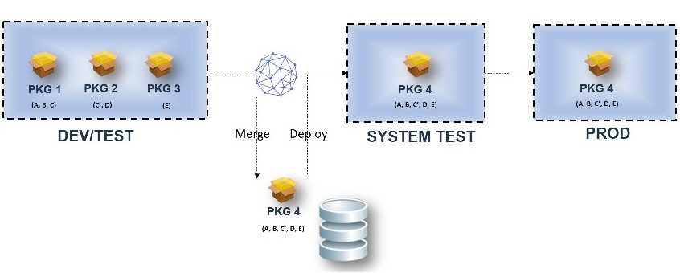
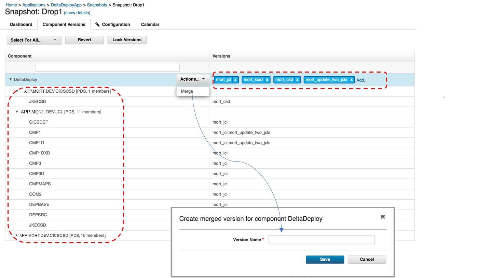

# Merging z/OS component versions

Two or more z/OS component versions can be merged from a snapshot into one component version to simplify the deployment to the next environment. Merging component versions in this way avoids deploying intermediate programs into production.

Note the following items when you merge z/OS components.

-   Only incremental versions of z/OS components can be merged.
-   Only versions stored in the UrbanCode Deploy CodeStation can be merged. The merged version is also stored in the CodeStation.
-   Only data sets are merged into the new version.
-   When two or more versions contain the same artifact, the artifact from the latest version in the snapshot is used.
-   All customer properties on containers are added to the container in the merged version. This might lead to deployment failures if the deployment process relies on properties on containers.
-   The merged version has version properties from the last version in the snapshot.

1.   Create a snapshot from an new or existing environment. 
2.   Add or delete versions in the snapshot's Component Versions view. The **Component** column lists the merged artifacts from all the selected versions. The **Versions** column displays all the versions that contain the artifacts. 
3.   From the **Actions** menu, click **Merge** for the selected components and supply a name for the merged version. Click **Save**. A new version is created from the merged content of the selected versions. 
4.   In the **Artifacts** view, click **Show SYS properties**. The source version name and ID are displayed.  

The following outcomes apply to merged versions.

-   Deployment, backup, and restore actions of merged versions proceed like any other version. No change is required in the deplomenty process.
-   Deleting or archiving the original version has no impact on the merged version.
-   A merged version can be merged with other versions again.
-   Properties that you set on a Partitioned Data Set \(PDS\) are added from all versions to the PDS in the merged version for the same properties. The later value for the property overwrites the former value.

    **Note:** Overwriting PDS properties might lead to deployment failures if your deployment process relies on the properties that you set in the PDS.

**Parent topic:** [Creating z/OS component versions](../topics/zos_runtools.md)

