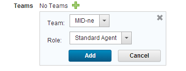

# Installing agents on Windows through WinRS

You can install agents remotely on Windows™ systems through WinRS.

You can use this method to install agents on versions of Windows that have Windows PowerShell, including Windows Server 2003, 2008, and 2012. As an alternative, you can install agents manually on most Windows systems as described in [Installing agents from the command line](agentInstall.md).

Before you can install agents on Windows systems remotely, you must first install an agent manually and designate that agent as the WinRS agent. Follow these steps:

1.  Install an agent on a Windows system via the command line. See [Installing agents from the command line](agentInstall.md).
2.  On the HCL® UrbanCode™ Deploy server, as an administrator, click **Settings** \> **System Settings**
3.  On the System Settings page, in the **WinRS Agent** field, select the agent that you installed on a Windows system.
4.  Click **Save**.
5.  Configure the system that hosts the WinRS agent:
    1.  Configure the system to communicate over WinRS by running the following commands on the command line. Each command must be on a single line.

        ```
        winrm quickconfig
        ```

        ```
        winrm set winrm/config/winrs @{MaxMemoryPerShellMB="1024"}
        ```

        If you do not have permission to run those commands, run the following commands instead:

        ```
        sc config "WinRM" start= auto
        ```

        ```
        net start WinRM
        ```

        ```
        winrm create winrm/config/listener?Address=*+Transport=HTTP
        ```

        ```
        netsh firewall add portopening TCP 80 "Windows Remote Management"
        ```

        ```
        netsh firewall add portopening TCP 5985 "Windows Remote Management"
        ```

        ```
        reg add HKLM\SOFTWARE\Microsoft\Windows\CurrentVersion\Policies\System /v LocalAccountTokenFilterPolicy /t REG_DWORD /d 1 /f
        ```

        ```
        winrm set winrm/config/winrs @{MaxMemoryPerShellMB="1024"}
        ```

    2.  Ensure that the user that runs the agent has the permission to map network drives.

Now that you have designated an agent as the WinRS agent, you can use that agent to install more agents remotely.

1.   Configure the system on which you want to install the agent: 
    1.   Configure the system to communicate over WinRS by running the following commands on the command line. Each command must be on a single line. 

        ```
        winrm quickconfig
        ```

        ```
        winrm set winrm/config/winrs '@{MaxMemoryPerShellMB="1024"}'
        ```

        If you do not have permission to run those commands, run the following commands instead:

        ```
        sc config "WinRM" start= auto
        ```

        ```
        net start WinRM
        ```

        ```
        winrm create winrm/config/listener?Address=*+Transport=HTTP
        ```

        ```
        netsh firewall add portopening TCP 80 "Windows Remote Management"
        ```

        ```
        netsh firewall add portopening TCP 5985 "Windows Remote Management"
        ```

        ```
        reg add HKLM\SOFTWARE\Microsoft\Windows\CurrentVersion\Policies\System /v LocalAccountTokenFilterPolicy /t REG_DWORD /d 1 /f
        ```

        ```
        winrm set winrm/config/winrs @{MaxMemoryPerShellMB="1024"}
        ```

    2.   If the agent system is not part of the same domain as the server, add each system to the trusted hosts of the other system. For example, run the following command:

        ```
        winrm set winrm/config/client @{TrustedHosts="HOST1,HOST2,HOST3"}
        ```

        If the systems are not part of the same domain, the agent must have the server host name in its list of trusted hosts. Similarly, the server must have the agent host name in its list of trusted hosts.

    3.   Enable file and printer sharing on the agent system. 
    4.   Create a user on the agent system. This user must have the following permissions: 

        -   Write to a temporary directory
        -   Write to the agent installation directory
        -   Create network shares
        -   Act as part of the operating system \(this permission is necessary only if you install the agent as a service\)
        The user must also be part of the administrator group.

    5.   If you are installing the agent as a service, the user that runs the service must have the permission to log on as a service. 
    6.   Ensure that each computer where you are installing an agent has a supported version of the Java™ Runtime Environment \(JRE\) or Java developer kit. For more information, see [System Requirements for IBM® UrbanCode Deploy](http://www-01.ibm.com/support/docview.wss?uid=swg27038801). 

        If the target computer has an IBM JRE or Java developer kit, update to a supported version of the IBM JRE or Java developer kit.

2.   On the HCL UrbanCode Deploy server, click **Resources** \> **Agents** and then click **Install New Agent**. 
3.   In the Install New Agent window, select **WinRS** 
4.   Specify the host name or IP address, user name, and password for the agent system. To specify multiple entries, type each one on a separate line. Agent names are the same as the host names or IP addresses that you enter.
5.   Select an agent installation property sheet from the **Agent Installation Properties** list, or use **New** to create a property sheet. Agent installation property sheets are templates that can be saved and used to install agents. You can create any number of agent installation property sheets. The agent installation properties are listed in the following table:

    |Field|Description|
    |-----|-----------|
    |**Name**|Name of the agent installation property sheet. This value is required.|
    |**Description**|Property sheet description.|
    |**Agent Dir**|Directory on the target where the agent is installed. This value is required.|
    |**Java Home Path**|Path to Java on the target. Typically, you enter the value of the JAVA\_HOME system variable of the agent system. Do not use the JAVA\_HOME variable itself, or any other variable, in this field; you must specify the complete literal path. For example, on a Microsoft™ Windows system, the Java home path might be C:\\Program Files\\Java\\jre. On a Linux™ system, the Java home path might be /usr/lib/jvm/default-java. This value is required.|
    |**Temp Dir Path**|Path to the directory that is used during installation for temporary files. This value is required.|
    |**Server Host**|Host name or IP address of the HCL UrbanCode Deploy server or agent relay to which the agent connects. This value is required.|
    |**Server Port**|The port that is used by the HCL UrbanCode Deploy server or agent relay to connect to the agent. The default port for connecting to the server is 7918. The default port for connecting to an agent relay is 7916. This value is required.|
    |**Proxy Host**|Host name or IP address of the agent relay, if used.|
    |**Proxy Port**|HTTP proxy port of the agent relay, if used. The default value is `20080`.|
    |**Auto Start**|If you want to install the agent as a service, select **Auto Start** to run the agent automatically when Windows starts. Windows only.|
    |**Service Name**|If the agent is installed as a service, enter a name for the agent service. Windows only.|
    |**Service User**|If the agent is installed as a service, enter a user name that has appropriate permission to run a service. Windows only.|
    |**Service Password**|If the agent is installed as a service, enter the password that is associated with the service user. Windows only.|

6.   Check **Assign Team** to assign the agent to a team. 

    

    1.   Click **Add** . 
    2.   Select the team to which you want to assign the agent from the **Team** list. 
    3.   Select the agent role from the **Role** list. For information about teams, see [Assigning teams directly to items](../../com.udeploy.doc/topics/../../com.udeploy.admin.doc/topics/security_teams_resources.md) 
7.   Click **Save**. 

Remotely installed agents start running automatically. If a remotely installed agent stops running, it must be restarted on the system that hosts the agent.

If you use mutual authentication, you must manually exchange a key between the agent and the server. For more information about this option, see [Configuring mutual authentication](../../com.udeploy.doc/topics/../../com.udeploy.install.doc/topics/ssl_mutual_auth.md).

If you are using a high-availability environment, configure the agent for failover to the other servers in the cluster. See [Configuring agents for failover](../../com.udeploy.doc/topics/../../com.udeploy.install.doc/topics/configure_agent_failover.md).

**Parent topic:** [Installing agents](../../com.udeploy.install.doc/topics/agent_install_ov.md)

