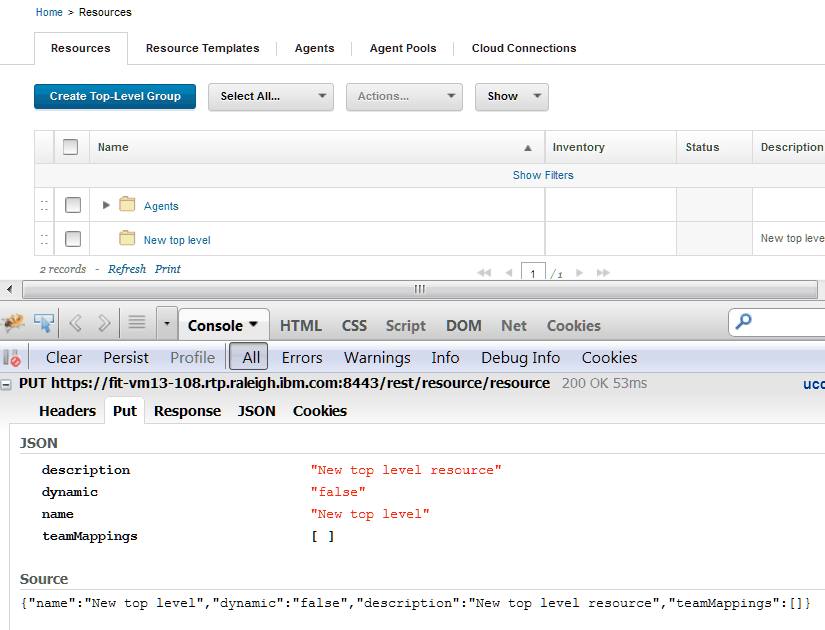

# Running REST commands

Many different programs can run REST commands. To run the command, you call a method on a REST resource and pass parameters or a request in JSON format.

**Note:** Using REST commands requires the same permissions as using the web interface. For information about permissions, see [Roles and permissions](../../com.udeploy.admin.doc/topics/security_roles.md).

## Example: Running simple REST commands with curl

The Linux™ program curl is a simple way to run REST commands. To run a REST command, put together the URL of one of the REST resources, specify the method to use, and add any parameters. For example, the following curl command retrieves a list of all active components. The command calls the GET method of the `component` resource and passes the value `true` for the parameter active:

```
curl -k -u jsmith:passw0rd 
  https://hostname:port/cli/component?active=true 
  -X GET
```

**Note:** You must enter this command on a single line. It is split onto different lines here for clarity.

**Note:** This example uses the `-k` switch to connect to the server without checking SSL certificate validity. To set up authentication, see [Authenticating for REST commands](rest_api_ref_authenticating.md).

This example uses the user name `jsmith` and the password `passw0rd`. In most cases, create a dedicated user account for the REST commands to use and give that account the appropriate permissions.

Use the host name and port of your server for `hostname` and `port`. For example, if the host name is `ucdeploy.example.com` and the port is the default value of 8443, the `curl` command might look like the following example:

```
curl -k -u jsmith:passw0rd 
  https://ucdeploy.example.com:8443/cli/component?active=true 
  -X GET
```

The response for this command is a JSONArray list of all active components on the server. For an example of this response, see [Get information about all components on the server](../../com.udeploy.api.doc/topics/rest_cli_component_get.md).

## Passing parameters to REST commands

Many REST commands have one or more parameters. To pass these parameters, add them to the URL. For example, the GET method of the `version/getLink` command takes three parameters: the name or ID of the application, the name or ID of the version, and the name of the link. To get a link on the `JPetStore-APP` component, the command might look like the following example:

```
curl -k -u jsmith:passw0rd 
  "https://ucdeploy.example.com:8443/cli/
  version/getLink?component=JPetStore-APP
  &version=1.0
  &linkName=IBM%20web%20site"
```

In this case, each parameter and value pair are appended to the URL, after a question mark \(`?`\). An ampersand \(`&`\) separates each pair. Because `curl` is a Linux command and the ampersand has a special meaning on the Linux command line, the URL, including the parameters, is enclosed in quotes.

**Note:** All parameter values must be URL encoded. The previous example passed the value `IBM web site` as the value for the linkName parameter. To include this parameter as part of the URL, the spaces must be changed to the URL encoded value `%20`.

## Passing JSON strings to commands

For more complex commands, you must send a JSON string or file instead of or in addition to the parameters.

For example, the PUT method of the `application/create` resource creates an application. To use this command, you must pass a JSON string that specifies the name, description, and some properties of the new application. The JSON string for this command must follow this template:

```
{
  "description": "Description",
  "enforceCompleteSnapshots": "Specify true to require 
     an explicit version for each component",
  "name": "Application name or ID",
  "notificationScheme": "Notification scheme"
}
```

This template is listed in the reference information for the command; see [Create an application from a JSON file](../../com.udeploy.api.doc/topics/rest_cli_application_create_put.md).

For example, the following JSON string represents an application that is named `My Application`:

```
{
  "description": "My new application",
  "enforceCompleteSnapshots": "false",
  "name": "My Application",
  "notificationScheme": "Default Notification Scheme"
}
```

To pass this JSON string to the `application/create` resource, you can either save the string to a file or include it in the command. For example, if you save the string to a file that is named newApplication.json, the command looks like the following example:

```
curl -k -u jsmith:passw0rd 
  https://ucdeploy.example.com:8443/cli/application/create 
  -X PUT -d @newApplication.json
```

You can also pass the string directly to the command, as shown in the following example:

```
curl -k -u jsmith:passw0rd 
  https://ucdeploy.example.com:8443/cli/application/create 
  -X PUT 
  -d {"description":"My new application",
      "enforceCompleteSnapshots":"false",
      "name":"My Application 67",
      "notificationScheme":"Default Notification Scheme"}
```

**Note:** The string that you pass to the command must be a valid JSON string.

## Composing JSON strings

There are two main ways to get the template of the JSON string for a command. The templates are listed in the reference information for each command. You can also run the equivalent command-line client command with the `-t` option. Running the CLI command with this option prints the JSON template.

Because the server interface uses the REST API, you can also log in to the server as usual and monitor the requests that the web application generates. You can monitor these requests with web browser extensions or external programs. For example, to see the JSON string for the PUT method of the `resource/create` resource, create a resource on the web server as usual and then look at the JSON string in the browser request, as shown in the following figure. The JSON string for the REST commands is the same or similar to this string.



## Accessing blueprints in REST commands

Most blueprint commands accept both a URL parameter and a Location header. For example, the command [Get the contents of a blueprint](../../com.edt.api.doc/topics/rest_bpid_get.md) has two parameters that refer to the target blueprint: the \{blueprintId\} parameter in the URL and the Location header. When commands have both of these parameters, the Location header takes precedence. Therefore, if you specify the complete location of the blueprint in the Location header, such as `/landscaper/orion/file/jsmith_8a6bfff7_2c77_45db_a235_adda61ad6653-OrionContent/myTeam/myBlueprint/myBlueprint.yml`, the command uses that blueprint regardless of the value of the \{blueprintId\} parameter. You can get the location of a blueprint with the [List blueprints](../../com.edt.api.doc/topics/rest_blueprint__get.md) command.

If the Location header is not specified, the command uses the value of the \{blueprintId\} parameter. In this case, the command assumes that the blueprint is in the default repository. It also assumes that the blueprint file name is the value of the \{blueprintId\} parameter plus the extension `.yml`.

## Responses

After a successful command, most commands return either a simple string value or a JSON string.

In addition to the result of the command, the commands return standard HTTP status codes. The following list includes the most common status codes that REST commands return.

-   **200**

    The command was successful.

-   **400®**

    -   You do not have permission to run the command.
    -   You did not specify a required parameter.
    -   The resource path in the URL is incorrect.
-   **404**

    The object that you are trying to retrieve does not exist.

-   **405**

    The HTTP method name is incorrect.

-   **415**

    The content type in the request header is incorrect.

-   **500**

    The server encountered an error.


**Parent topic:** [REST API reference](../../com.udeploy.reference.doc/topics/rest_api_ref_overview.md)

