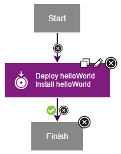

# Lesson 5: Create an application process

Application processes direct underlying component processes and orchestrate multi-component deployments.

An application process, like a component process, consists of steps that are configured with the process editor. In this lesson, you create an application process that installs the helloWorld component by calling the component process that you created earlier. You must use application processes to deploy components.

1.   Click the **Applications** tab, and then click **hello Application**. 
2.   Click **Processes**, and then click **Create Process**. 
3.  In the Create an Application Process window, name the new application process something like hello App Process.
4.   Accept the default values for the other fields, and click **Save**. 
5.  To open the new process in the process editor, click the new process.
6.  Add a step that deploys the helloWorld component: 
    1.   From the list of steps, add an **Install Component** step to the design area, and then on the process step click the **Edit** icon . 
    2.  In the Edit Properties window, name the step something like Deploy helloWorld. 
    3.  In the **Component** list, select the **helloWorld** component.All components that are associated with an application are available.
    4.  In the **Component Process** list, select the **helloProcess** component process. If multiple processes were defined for the helloWorld component, they are listed.
    5.  In the **Limit to Tag** list, select the **blueCycle** tag that you defined earlier. After you select **blueCycle**, the application deploys only components with this tag.
    6.   Accept the default values for the other fields, and click **OK**. 
7.   Verify that the **Start** step is connected to the **Deploy helloWorld** step. 
8.   Verify that the **Deploy helloWorld** step is connected to the **Finish** step. 
9.   Save the process by clicking **Save**. 

The complete application process looks like the following figure:

In this lesson, you created an application process that deploys the helloWorld component.

The **Processes** tab lists the application process.

For more information about creating application processes, see [Application processes](../../com.udeploy.doc/topics/app_process.md).

**Parent topic:** [Create a simple helloWorld deployment](../../com.udeploy.tutorial.doc/topics/quickstart_abstract.md)

