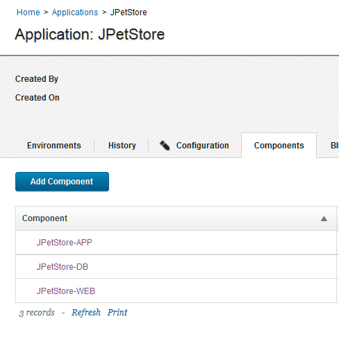
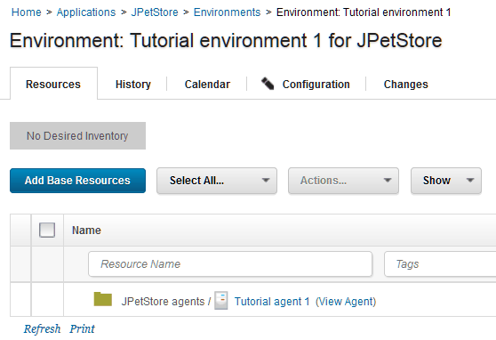
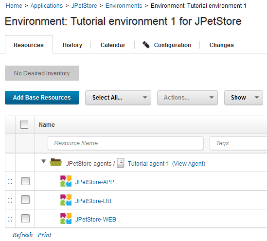

# Lesson 3: Creating an application and an environment

Applications are collections of components. Environments represent systems on which you deploy the application components.

Before you start this lesson, ensure that your agent is running. Click **Resources** \> **Agents** and make sure that your agent is listed as `Online`, as in the following figure:

In this lesson, you add the three components to an application and then create an environment on which to deploy the application. You also add your agent to the environment.

**Parent topic:** [Deploying a simple web application](../../com.udeploy.tutorial.doc/topics/webapp_abstract.md)

## Creating an application

Creating an application involves selecting the components that are in the application.

1.   Click the **Applications** tab, and then click **Create Application**. 
2.   Name the new application `JPetStore`, and then click **Save**. 
3.  Add the components to the application: 
    1.   Click the **Applications** tab, and then click the new application, `JPetStore`. 
    2.   Click the **Components** tab for the application \(not the **Components** tab at the top of the page\), and then click **Add Component**. 
    3.  In the Add a Component window, in the **Select a Component** list, select the three components: `JPetStore-APP`, `JPetStore-WEB`, and `JPetStore-DB`.
    4.  Click **Save**.

The application includes the three components, as shown in the following figure. Components can be included in any number of applications.

## Creating an environment

Creating an environment involves selecting one or more agent resources and specifying which components are deployed to each agent resource.

1.  Define an environment for the application: 
    1.  Go to the **Environments** tab for the application.
    2.   Click **Create Environment**. 
    3.  Specify the name to be Tutorial environment 1.
    4.  Accept the defaults in the other fields in this window and click **Save**.
2.  Specify the properties for the environment.When you created the component processes, you included parameters that specify the location of artifacts on the target system, such as the location of the application server. Because these properties can vary on different target systems, you specify these properties as environment properties.
    1.  Open the environment by clicking the environment name. 
    2.  Open the environment properties by clicking **Configuration** and then clicking **Environment Properties**. 
    3.  Add the following properties one at a time by clicking **Add Property** and specifying the name and value of the property as shown in the following table:

        |Property|Description|Example|
        |--------|-----------|-------|
        |`tomcat.home`|The Tomcat home folder on the target computer|/opt/apache-tomcat-6.0.39 on Linux™ or C:\\apache-tomcat-6.0.39 on Windows™|
        |`tomcat.contextroot`|The Tomcat webapp folder on the target computer, which is an identifier in the application URL|For all versions of Tomcat, specify `JPetStoreDev`|
        |`db.url`|The URL to the MySQL database, relative to the target system|If you installed MySQL on the same system as the agent and used the database name `jpetstore`, the URL looks like the following example: `jdbc:mysql://localhost:3306/jpetstore`|
        |`tomcat.manager.url`|The location of the Tomcat manager application|For Tomcat version 6, specify `http://localhost:8081/manager` ; for Tomcat version 7 or 8, specify `http://localhost:8081/manager/text`|
        |`tomcat.start`|The location of the startup script for Tomcat|/opt/apache-tomcat-6.0.39/bin/startup.sh on Linux or C:\\apache-tomcat-6.0.39\\bin\\startup.bat on Windows|

3.  Add the agent to the environment.When you set up the agent, you added the agent as a resource to a resource group. Now you can use that resource as part of the environment, as described in the following steps:

    1.  Click the **Resources** tab for the environment.Make sure that you are on the **Resources** tab for the environment and not the **Resources** tab at the top of the page.
    2.  Click **Add Base Resources**. The Add Resource to Environment window shows all of the resources that are available on the server. 
    3.  Select the check box next to your agent and then click **OK**. 
    The resource is shown on the Resources tab for the environment, as shown in the following figure:

    

4.  Map the components to this agent resource. If you had many agents on a system with multiple nodes, you would specify which components run on each agent resource. In this case, you have only one agent resource, so all of the components run on this agent.

    1.  On the same row as the agent resource, click **Actions** \> **Add Component**.The **Actions** button does not appear until you hover the mouse over the resource.
    2.  Select the application component and then click **Save**. 
    3.  Repeat the process to add the other components to the resource.

        **Note:** Be sure to add each component to the agent resource and not to another component. The components must be at the same hierarchy level, and not as child items of each other.

    Now the components are mapped to the target system, as shown in the following figure:

    

The new environment appears on the Environments tab. Now that the environment is prepared and the agent is running, you can run application processes on the environment to deploy the components.

