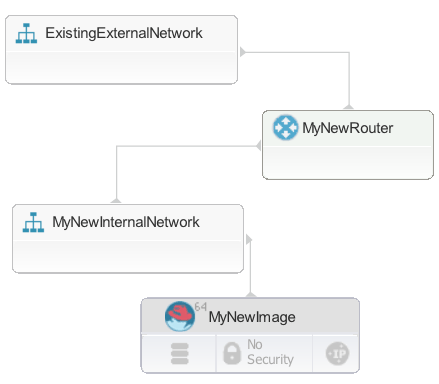

# Modeling new network resources

You can model new network resources, such as routers and networks. When you provision the blueprint, the target cloud creates the network resources.

The type of cloud resources that you can create depends on the target cloud. Ensure that the blueprint designer palette shows the correct resource types by verifying that you are connected to the correct cloud project before you begin to model network resources.

-   **OpenStack and OpenStack-based clouds**

    In the blueprint designer, you can create networks, subnets, and routers. When you provision an environment from the blueprint, the engine creates corresponding network resources on the OpenStack cloud. Because the engine is a Heat-compliant engine, you can also edit the source code of blueprints to add other OpenStack Neutron and Nova types. The engine creates these other types at provisioning time, too. However, these types are not included in the blueprint designer.

    This table describes the network resources that you can connect to or create on OpenStack and OpenStack-based clouds.

    |Network resource|Connect to an existing network resource|Model a new network resource in the blueprint graphical editor and provision a new instance|Code a new network resource in the blueprint code and provision a new instance|
    |----------------|---------------------------------------|-------------------------------------------------------------------------------------------|------------------------------------------------------------------------------|
    |Network|\*|\*|\*|
    |Router|\*|\*|\*|
    |Security group|\*| |\*|
    |Subnet|\*|\*|\*|
    |Port|\*| |\*|

-   **Amazon Web Services \(AWS\)**

    In the blueprint designer, you can create networks, routers, and subnets. When you provision an environment from the blueprint, the engine creates equivalent network resources on AWS. For example, if you create a network in the blueprint and then create a configuration file for AWS, the configuration file maps the `OS::Neutron::Net` OpenStack resource type to the `IBM::EC2::VPC` AWS resource type. Therefore, when you provision an environment from that blueprint and configuration file, the engine creates a virtual private cloud \(VPC\) on AWS.

    This table describes the network resources that you can connect to or create on AWS.

    |Network resource|Connect to an existing network resource|Model a new network resource in the blueprint graphical editor and provision a new instance|Code a new network resource in the blueprint code and provision a new instance|
    |----------------|---------------------------------------|-------------------------------------------------------------------------------------------|------------------------------------------------------------------------------|
    |Network|\*|\*|\*|
    |Router|\*|\*|\*|
    |Security group|\*| |\*|
    |Subnet|\*|\*|\*|
    |Port|\*| |\*|
    |Internet Gateway| | |\*|

-   **SoftLayer®**

    Modeling new SoftLayer® network resources in blueprints is not supported. You must create network resources separately and attach resources to those network resources; see [Attaching resources to existing networks](blueprint_network_existing.md).

    |Network resource|Connect to an existing network resource|Model a new network resource in the blueprint graphical editor and provision a new instance|Code a new network resource in the blueprint code and provision a new instance|
    |----------------|---------------------------------------|-------------------------------------------------------------------------------------------|------------------------------------------------------------------------------|
    |Network|\*| | |
    |Router|\*| | |
    |Security group|\*| | |
    |Subnet|\*| | |
    |Port|\*| | |

-   **VMware**

    **Restriction:** VMware NSX is required for creating network resources on VMware clouds. Without NSX, you can attach resources to existing networks, but you cannot create network resources; see [Attaching resources to existing networks](blueprint_network_existing.md).

    VMware NSX provides a networking layer on top of VMware vCenter. When you are using VMware NSX with VMware vCenter, you can model new networks and routers in the blueprint designer. These resource types are not available in the palette; you must add the types to the blueprint source code manually.

    When you provision environments from the blueprint, the engine creates equivalent network resources on NSX. For example, if you add a network to a blueprint and then create a configuration file for VMware, the configuration file maps the `OS::Neutron::Net` OpenStack resource type to the `IBM::VCenter::Network` VMware resource type. Therefore, when you provision an environment from that blueprint and configuration file, the engine attempts to create a network on NSX.

    **Note:** Network creation on NSX is a preview feature and is not supported.

    **Restriction:** Not all VMware resource types are implemented. For example, if you include the types `IBM::VCenter::Port`, the engine ignores those resources. The engine creates only new networks and new routers.

    Similarly, the blueprint design server does not support creating subnets or datastores on NSX; if you specify a subnet or datastore in the blueprint, those resources are ignored. New instances are always added to the resource pool, not to other locations such as datastores or clusters.

    This table describes the network resources that you can connect to or create on VMware NSX.

    |Network resource|Connect to an existing network resource|Model a new network resource in the blueprint graphical editor and provision a new instance|Code a new network resource in the blueprint code and provision a new instance|
    |----------------|---------------------------------------|-------------------------------------------------------------------------------------------|------------------------------------------------------------------------------|
    |Network|\*|\*|\*|
    |Router|\*|\*|\*|
    |Security group|\*| | |
    |Subnet|\*| |\*|
    |Port|\*| | |

-   **Azure**

    Modeling new Azure network resources in blueprints is not supported. You must create network resources separately and attach resources to those network resources; see [Attaching resources to existing networks](blueprint_network_existing.md).

    |Network resource|Connect to an existing network resource|Model a new network resource in the blueprint graphical editor and provision a new instance|Code a new network resource in the blueprint code and provision a new instance|
    |----------------|---------------------------------------|-------------------------------------------------------------------------------------------|------------------------------------------------------------------------------|
    |Network|\*| | |
    |Router|\*| | |
    |Security group|\*| | |
    |Subnet|\*| | |
    |Port|\*| | |


To model new network resources, drag them from the blueprint designer palette or add them to the blueprint source code directly. Then, connect the network resources to other resources, such as virtual images.

For example, the following steps describe how to add new images to a new internal network and then connect that internal network to an existing external network via a new router.

1.  In a blueprint, add one or more images.
2.  From the **Networks** drawer of the palette, add a **New Internal Network** to the blueprint, and connect the images to the network.
3.  Add a subnet to the internal network:
    1.  In the source code for the blueprint, add a subnet resource. Use the `OS::Neutron::Subnet` resource type.
    2.  At minimum, specify the following properties for the subnet resource:

        -   **network\_id**

            Specify the ID of the network that contains the subnet or a reference to that network.

        -   **cidr**

            Specify the range of IP addresses in Classless Inter-Domain Routing \(CIDR\) format.

        For example, the following code shows a new network that is named `MyNewInternalNetwork`. Then, it shows a new subnet that is on that network. This subnet is connected to the network and represents the IP address range of 192.168.99.0 through 192.168.99.255.

        ```
          MyNewInternalNetwork:
            type: OS::Neutron::Net
            properties:
              name: MyNewInternalNetwork
              
          MyNewSubnet:
            type: OS::Neutron::Subnet
            properties:
              name: 'MyNewSubnet'
              network_id: { get_resource: MyNewInternalNetwork }
              cidr: '192.168.99.0/24'
        ```

4.  Add the existing external network to the blueprint.
5.  Add a router to the blueprint.
6.  Connect the internal network and external network to the router.

The new internal network is connected to the external network through the new router. When you provision an environment from this blueprint, the engine creates matching network artifacts on the OpenStack or OpenStack-based cloud. The following figure shows an example of how the blueprint might look in the editor. The subnet is not shown on the diagram.



## Creating network resources in VMware

As another example, the following steps describe how to create network resources in VMware NSX. Because the NSX types are not fully implemented, you must provide NSX properties in the blueprint code so they are passed to the VMware types in the configuration file.

1.  In a blueprint, add one or more images.
2.  From the **Networks** drawer of the palette, add a **New Internal Network** to the blueprint and connect the images to the network.
3.  In the blueprint source code, specify VMware properties for the new network. Because no VMware network type is yet implemented, you must use the OpenStack type `OS::Neutron::Net` and add properties for VMware, as in the following example:

    ```
    MyNewInternalNetwork:
       type: OS::Neutron::Net
       properties:
           name: MyNewInternalNetwork
       metadata:
          vmware_properties:
             transport_zone_id: vdnscope-1
             edge_name: { get_param: edge_name }
             resource_pool: { get_param: vmware_resource_pool }
             appliance_size: compact
    ```

    In the section `vmware_properties`, specify the following properties:

    -   **transport\_zone\_id**

        The ID of the transport zone.

    -   **edge\_name**

        The name of the edge appliance.

    -   **resource\_pool**

        The resource pool to put the network in.

    -   **appliance\_size**

        The size of the appliance.

4.  Add a subnet of the type `OS::Neutron::Subnet` to the network, as in this example:

    ```
      MySubnet:
        type: OS::Neutron::Subnet 
        properties:
            network_id: { get_resource: MyNewInternalNetwork }
            cidr: 172.17.17.1/24
            allocation_pools:
              - start: 172.17.17.210
                end: 172.17.17.230
              - start: 172.17.17.231
                end: 172.17.17.250
            gateway_ip: 172.17.17.1
        metadata:
            vmware_properties:
                lease_time: "14400"
                domain_name: mynsx.example.org
    
    ```

    In the section `vmware_properties`, specify the following properties:

    -   **lease\_time**

        Specify the lease time or the value `infinite`.

    -   **domain\_name**

        Specify the domain name of the DHCP pool.

5.  Add a router of the type `OS::Neutron::Router`, as in the following example:

    ```
    MyRouter:
        type: OS::Neutron::Router
        # Add dependency on network to locate edge_id
        depends_on: MyNewInternalNetwork
        properties:
            name: MyRouter
            external_gateway_info:
              network: productionExample
        metadata:
            vmware_properties:
                external_cidr: 10.104.175.123/26
                mtu: 2000
    ```

    In the section `vmware_properties`, specify the following properties:

    -   **external\_cidr**

        Specify the IP address range for external traffic, in CIDR format.

    -   **mtu**

        Specify the MTU value for the uplink interface.

6.  Add a router interface of the type `OS::Neutron::RouterInterface` to connect the router to the subnet, as in the following example:

    ```
    router_interface-1:
       type: OS::Neutron::RouterInterface
       properties:
         router_id: { get_resource: MyRouter }
         subnet_id: { get_resource: MySubnet }
    ```

7.  Add a port of the type `OS::Neutron::Port` and connect it to the router and subnet, as in the following example:

    ```
      router_interface:
         type: OS::Neutron::RouterInterface
         properties:
           router_id: { get_resource: MyRouter }
           subnet_id: { get_resource: MySubnet }
    ```

8.  Specify the output attributes of the blueprint in the outputs section. Attributes are commonly used to provide relevant derived values. In this case, the attributes are the ID of the edge services gateway on the logical switch and the ID of the port group that is associated with that logical switch.

    ```
    outputs:
      edge_id:
        description: The ID of the edge services gateway attached to the logical switch
        value: { get_attr: [MyNewInternalNetwork, edge_id] }
      portgroup_id:
        description: The ID of the portgroup associated with the logical switch
        value: { get_attr: [MyNewInternalNetwork, portgroup_id] }
    ```


Now when you provision an environment from this blueprint, the engine creates network resources on VMware NSX.

**Parent topic:** [Modeling networks](../../com.ibm.edt.doc/topics/blueprint_network_ov.md)

