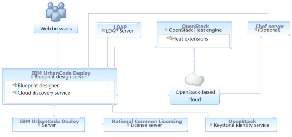

# Connecting to OpenStack and OpenStack-based clouds

There are two ways to connect to an OpenStack cloud or a cloud that is based on OpenStack, such as IBM® Cloud Orchestrator. Which method you choose depends on whether you want to use user accounts from an LDAP server or from an OpenStack Keystone server.

The following diagrams show summaries of these two methods of connecting to OpenStack-based clouds.

In the first diagram, the blueprint design server retrieves account information from an LDAP server and authentication information from the Keystone identity service.

In the second diagram, the blueprint design server retrieves both account and authentication information from the Keystone identity service. 

-   **[Connecting to OpenStack-based clouds with LDAP authentication](../../com.ibm.edt.doc/topics/cloud_connect_openstack_ldap.md)**  
To connect to an OpenStack cloud and use accounts from an LDAP server for authentication, create a cloud connection and cloud projects manually. Then, add the cloud projects to teams and add LDAP users to those teams.
-   **[Connecting to OpenStack-based clouds with Keystone authentication](../../com.ibm.edt.doc/topics/cloud_connect_openstack_keystone.md)**  
To use the accounts on an OpenStack Keystone server for authentication to the OpenStack cloud connection, create an authentication realm that points to the Keystone server. Then, configure security for that authentication realm.
-   **[Configuring OpenStack images](../../com.ibm.edt.doc/topics/cloud_connect_openstack_images.md)**  
Before you can use images on an OpenStack or OpenStack-based cloud with the blueprint designer, you must configure cloud-init on those images.
-   **[Using a dedicated environment to create Chef-compatible images on OpenStack-based clouds](../../com.ibm.edt.doc/topics/integrate_chef_images_openstack.md)**  
To create images for OpenStack-based clouds that can use Chef, set up a development environment that includes the prerequisites, and then use the disk-image-create command.
-   **[Configuring SSL security for OpenStack clouds](../../com.ibm.edt.doc/topics/cloud_connect_ssl.md)**  
If your OpenStack cloud uses SSL security, you must import the security certificate into the blueprint design server keystore.
-   **[Configuring HTTPS security for OpenStack clouds](../../com.ibm.edt.doc/topics/integrate_os_https.md)**  
If your OpenStack server connects through HTTPS, you must import the OpenStack server key into the blueprint design server keystore.

**Parent topic:** [Connecting to clouds through the blueprint designer](../../com.ibm.edt.doc/topics/security_cloud_connection.md)

