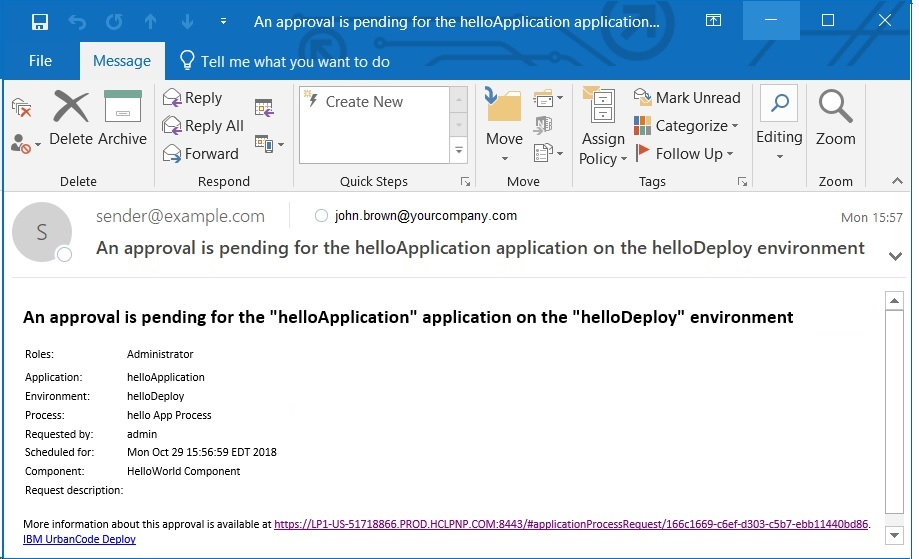

# Creating an approval process

An approval process is configured for an application environment when your organization requires formal decisioning of a deployment. The approval process identifies the deployment that needs approval and the role of the approver. Approval to deploy is granted or denied by the approver.

Before an approval process can be configured, these prerequisites must be met.

-   An **ApprovalCompleted** notification template exists for use in the approval process.

-   **Require Approvals** is enabled for an environment. In the application environment, select **Configuration** at the task bar and ensure that the **Require Approvals** check box is enabled in the Basic Settings window. **Approval Process** will be enabled in the environments task bar.

**Tip:** The environment developer can also select the **No Self-Approvals** check box that follows the **Require Approvals** check box. When this check box is selected, the user who sets up of the approval process cannot subsequently approve the process.

1.   To create an approval process, display the Approval Process Design pane \(**Applications** \> **application name** \> **Environments** \> **Environment: environment name** \> **Approval Process**. 
2.   Configure the steps that need approval from the process editor. The steps are based on job type and the role of the approver. You have the option of selecting three job types: the application, component, or environment. For help on the process editor, see [Processes](comp_workflow.md). 

    **Note:** If a scheduled deployment that requires approval reaches its start time and the approval is not given, the process does not run and acts as a rejected request. To resubmit a request, you must request a new process. If a process with an approval does not have a scheduled deployment time, the process remains idle until a response is made.

3.   To view the status of the request, display the Deployment Detail pane on the Reports tab. If a request is approved, it is displayed as a success. However, if the request was rejected, it shows as failed. If a request is failed, display the Application Process Request by clicking **view request**. 
4.   To view the status of the request, display the Deployment Detail pane on the Reports tab. If a request is approved, it is displayed as a success. However, if the request was rejected, it shows as failed. If a request is failed, display the Application Process Request by clicking **view request**. 
5.   If a comment is made regarding the process, you can view it by clicking the log push button in the actions column on the Application Process Request. 

    An example of a default **ApprovalCreated** notification template that is sent to indicate that an approval is required is shown.

     

-   **[Work items](../topics/app_approvals_workitems.md)**  
If a job requires approval, an approval process must be created. Then, the job displays in the approver’s Work Items tab.

**Parent topic:** [Applications](../topics/applications_ch.md)

