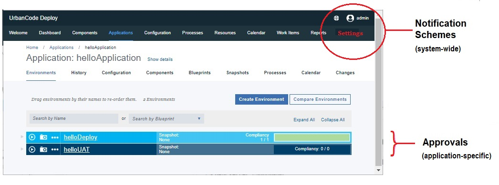

# Working with Notifications

HCL® UrbanCode™ Deploy can send email notifications whenever user-defined trigger events occur on the server.

Notifications can be sent to different users during deployment, as a way of providing updates to the status of the deployment. For example, notifications can be sent when a deployment finishes or if an approval was accepted or rejected.

Notifications are defined in Notification Schemes. Notification Schemes allow multiple notifications to be configured and assigned to a process. Refer to [Creating Notifications in a Notification Scheme](notify_create.md).

## Notification-Approval Relationship

Notifications and approvals are two separate areas of functionality and are configured in two separate areas in the user interface. They are also typically configured by different types of users.

**Note:** Do not confuse creating the notification for an approval with actually creating the approval itself. Refer to [Creating an approval process](app_approvalCreate.md).

Notifications are managed at a system-wide level, typically by the system administrator and can be shared across applications. Notification emails are provided for informational purposes only, and do not affect the execution of the deployment. They do not require user intervention.

Approvals are managed at an application level and require an environment developer user role. Approvals, unlike notifications, are actionable events. They are configured in an approval process and require user-intervention \(acceptance or rejection of a deployment in a specific environment\). If approved, the deployment executes. If rejected, the deployment remains in an on-hold status.

The only relationship between notifications and approvals is when an action defined in an approval process triggers an approval notification email.

-   **[Creating Notifications in a Notification Scheme](../topics/notify_create.md)**  
Notifications are defined in a notification scheme. This topic describes how to configure notifications as part of a notification scheme. The notification scheme is assigned to an application and the notifications are sent during the deployment of that application.

**Parent topic:** [Server settings and configuration](../topics/settings_ch.md)

