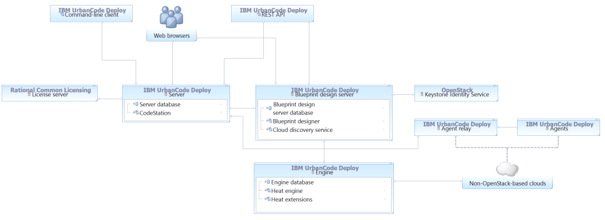

# Systems and topology overview

HCL® UrbanCode™ Deploy includes several systems, including a server and one or more agents. You can configure multiple topologies, including ones that use high availability, containerized servers running in IBM Cloud Private, disaster recovery, and the blueprint designer, to meet your needs.

The following system topologies, including diagrams, are shown. For explanation of the system components, see the [Description of systems](#description_system).

-   [Core topology](#core)
-   [Blueprint design topologies](#blueprint_design)
-   [Multi-region topology](#multi_region)
-   [High-availability clustered topologies](#ha_cluster)
-   [Disaster recovery topologies](#disaster_recovery)
-   [Default ports](#default_ports)
-   [Description of systems](#description_system)

## Core topology

The core installation of HCL UrbanCode Deploy includes a server, agents, and a license server. Clients access the server through web browsers, the REST API, or the command-line client. Agents can be installed on cloud environments, virtual machines \(VMs\), containers, or physical systems; the agents are shown on cloud systems in the following diagrams, but they can be installed on many different systems.

With this topology, the server can create environments on clouds that use virtual system patterns \(VSPs\), such as IBM® Cloud Orchestrator and IBM PureApplication® System. For more information about supported clouds that use VSPs, see [Modeling environments for clouds that use virtual system patterns](../../com.ibm.edt.doc/topics/blueprint_edit_clouds_vsp.md#). To create environments on other clouds such as Amazon Web Services, SoftLayer®, VMware vCenter, and Microsoft™ Azure, you must install the blueprint design server and at least one engine, as described in the blueprint design topologies.

To install the core components, see [Installing HCL UrbanCode Deploy](../../com.ibm.udeploy.install.doc/topics/install_ch.md#).

## Blueprint design topologies

To work with blueprints on clouds via OpenStack Heat, including OpenStack-based clouds, Amazon Web Services, SoftLayer, VMware vCenter, and Microsoft Azure, you must apply a topology that includes the blueprint design server and engine. \(In previous versions, these systems were part of IBM UrbanCode Deploy with Patterns.\)

**Installing a standalone engine**

To deploy environments to non-OpenStack clouds, such as Amazon Web Services, SoftLayer, VMware, Google Cloud, and Microsoft Azure, you install the blueprint design server and Heat engine through HCL UrbanCode Deploy. The following diagram shows a typical topology for this use case:

**Extending Heat orchestration engines**

To deploy environments to clouds that are based on OpenStack, you install the blueprint design server and extend the Heat engine that is associated to the cloud. In this case, you do not use the Heat engine that comes with HCL UrbanCode Deploy. The following diagram shows a typical topology for this use case:

## Multi-region topology

If your environment has multiple security zones that are divided by firewalls, you can use agent relays to connect agents to the server through the firewalls. For example, if your HCL UrbanCode Deploy server is within a firewall, but your target environments are outside the firewall, the agents on those target environments cannot connect directly to the server. In this case, you install an agent relay outside the firewall to allow the agents to connect to the server through the firewall, as shown in the following diagram.

To install and configure an agent relay, see [Installing agent relays](../../com.ibm.udeploy.install.doc/topics/agentRelayInstall.md).

## High-availability clustered topologies

High-availability topologies use multiple servers. These servers can all be running at the same time to share the load \(as in a clustered topology\), or they can be waiting for another server to fail \(as in a cold standby topology\). The following diagram shows a clustered topology in which a load balancer distributes connections to three servers. Users connect directly to the load balancer, which sends them to an active server. Agents connect via HTTP and HTTPS to the load balancer; however, the agents connect via JMS directly to the servers. The servers store their files on a shared database and file system.

To configure a cluster of servers, see [Setting up clusters of servers](ha_config_server.md#).

You can also cluster blueprint design servers and engines. In this case, you install one or more blueprint design servers and engines, and set them each to access the same database and shared file system. Similarly, a load balancer distributes traffic to the blueprint design servers and engines. The following diagram shows a clustered topology with three engines and three blueprint design servers, connecting to one or more non-OpenStack clouds:

To connect to OpenStack-based clouds, the topology is different because the Heat engines are installed via the OpenStack server, not via HCL UrbanCode Deploy:

To configure a cluster of blueprint design servers and engines, see [Setting up clusters of blueprint design servers](ha_config_bds.md#) and [Setting up clusters of engines](ha_config_engine.md#).

## Disaster recovery topologies

One way to prepare for disaster recovery is to have a cold standby system, including a stopped server and a replicated copy of the database and file system. The following diagram shows a simple topology with a cold standby server and related resources on standby.

To configure a cold standby system for the server, see [Adding cold standby servers](../../com.ibm.udeploy.install.doc/topics/server_install_cold.md#).

You can also configure a disaster recovery system for the blueprint design server and engine. The following diagram shows a disaster recovery topology for the blueprint design server and Heat engine where the cold standby servers are located in a different data center. In this diagram, the shared systems and services should be configured for high availability.

To configure disaster recovery for the blueprint designer, see [Configuring disaster recovery for the blueprint design server](dr_config_bds.md#).

## Default ports

The following diagram shows the default port numbers that HCL UrbanCode Deploy uses for communication. Most of these ports can change depending on your choices at installation time. The following diagram is only a summary of the defaults.

For more information about ports, see [System requirements and performance considerations](../../com.ibm.udeploy.install.doc/topics/sysRequire.md).

## Description of systems

-   **HCL® UrbanCode™ Deploy server**

    The HCL® UrbanCode™ Deploy server stores components, processes, and other elements with which you model automated application deployments. You run automated deployments from the server.

-   **Web browsers**

    Web browsers are the main way that users interact with the server and blueprint designer. The HCL® UrbanCode™ Deploy browser-based GUI is a Rich Internet Application \(RIA\) that maintains much of its functionality in the browser. Clients interact with RESTful \(representational state transfer\) services on the server as needed.

-   **Command-line client**

    The command-line client provides access to the server through the command line. It can automate functions on the server, such as creating components and applications, and provides most of the features that are found in the browser-based GUI. The command-line client is also built on top of RESTful services. See [Command-line client \(CLI\) reference](../../com.ibm.udeploy.reference.doc/topics/cli_ch.md).

-   **REST API**

    The REST API provides access to the server through HTTP. Like the command-line client, it can automate functions on the server, such as creating components and applications.

    The server and the blueprint design server have separate REST APIs. Each command in the server REST API has an equivalent command in the command-line client; however, commands in the blueprint design server API do not have command-line equivalents. See [Extending product function](c_node_extending.md).

-   **Agents**

    The agents run processes on target systems. Agents can run on physical computers, virtual systems, or cloud systems. See [Agents](resources_agents.md#).

-   **Agent relays**

    An agent relay is a communication proxy for agents that are located behind a firewall or in another network location. See [Agent relays](arch_agent_relays.md#).

-   **Blueprint design server**

    This server hosts the blueprint designer and controls access to blueprints, the files that describe network topology for applications that you provision to different clouds. It also hosts the cloud discovery service, which provides information about the available cloud resources to the blueprint designer. \(In previous versions, this system was the IBM® UrbanCode™ Deploy with Patterns design server.\) For more information about using the blueprint designer, see [Modeling environments for clouds through OpenStack Heat](../../com.ibm.edt.doc/topics/blueprint_edit_clouds.md#).

-   **Engine**

    The Heat engine is an installation of the OpenStack Heat orchestration engine with IBM® extensions. The engine manages cloud infrastructure, provisioning resources from clouds, updating those resources, and deleting them. To connect to non-OpenStack clouds, you install the Heat engine that is provided with HCL® UrbanCode™ Deploy, which includes the extensions. To connect to OpenStack clouds, you extend an existing Heat engine by adding the extensions to it. \(In previous versions, this system was the IBM® UrbanCode™ Deploy with Patterns Heat engine.\)

-   **Rational® Common Licensing license server**

    The license server provides licenses to the server. For more information on the license server, see [IBM® Rational® Common Licensing](http://www-01.ibm.com/support/knowledgecenter/SSSTWP).

-   **Keystone Identity Service**

    This service provides authentication tokens to the OpenStack system. The blueprint design server requires it. If you do not have a Keystone service, you can use one that is provided with the Heat engine.

-   **Clouds**

    The clouds host virtual resources. When you create environments with blueprints, the server or engine provisions resources on the target clouds. For information about supported clouds, see [Integrating with cloud systems](cloud_integrate_ov.md#).

-   **CodeStation**

    CodeStation stores component versions and artifacts. It is part of the HCL® UrbanCode™ Deploy server.

**Parent topic:** [Overview of HCL UrbanCode Deploy](../topics/intro_ch.md)

