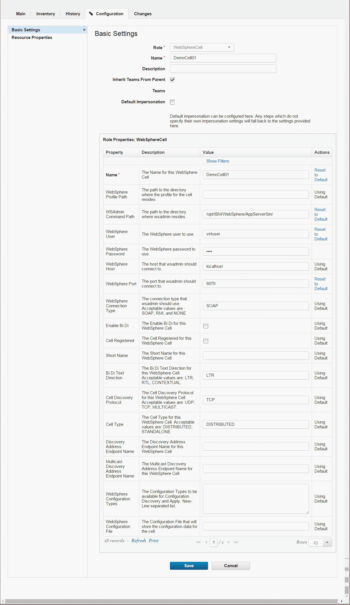

# Importing resources from WebSphere Portal

With the WebSphere® Portal plug-in, you can discover resources for a portal cell and use plug-in steps to deploy artifacts.

-   Create a top-level resource group to contain agents. See [Creating groups](resources_createGroup.md).
-   Install an agent on the system that hosts the portal node.
-   If IBM® WebSphere Application Server is deployed in a directory other than the default directory, specify the wsadmin.path property on the agent.
    1.  Click **Resources** \> **Agents** \> **agent name** \> **Configuration** \> **Agent Properties**.
    2.  Add a property named wsadmin.path.
    3.  Set the wsadmin.path property to the fully qualified path to the `wsadmin` script, including the script name.

        The default location of the wsadmin file on Linux™ is /opt/IBM/WebSphere/AppServer/bin/wsadmin.sh. The default locations on Microsoft™ Windows™ are C:\\IBM\\WebSphere\\AppServer\\bin\\wsadmin.bat and C:\\Program Files\\IBM\\WebSphere\\AppServer\\bin\\wsadmin.bat.

-   Install the WebSphere Portal plug-in.
-   Install the WebSphere Application Server - Deploy plug-in.

Plug-ins can be developed and updated more frequently than HCL® UrbanCode™ Deploy provides release cycles. For the latest version of the WebSphere Portal plug-in and the latest documentation, see the [IBM UrbanCode™ Deploy Plug-ins](https://developer.ibm.com/urbancode/plugins/ibm-urbancode-deploy) site.

1.   On the HCL UrbanCode Deploy server, click **Resources** to view the Resource Tree page. 
2.   Click the **Actions** push button that is associated with the top-level group, and then click **Add Agent**. 
3.   In the Create Resource window, select the agent and then click **Save**. The new agent resource is displayed in the resource tree. Eventually, another resource is displayed under the agent resource. This resource is named `WebSphereCell` and represents the WebSphere Application Server cell. You might need to click **Refresh** to see the cell resource, and it can take several minutes for the cell resource to be displayed.
4.   Click the WebSphere Application Server cell resource and then click **Configuration** \> **Basic Settings**. The cell resource has the `WebSphereCell` role, which includes several properties that are related to the cell.
5.  In the section that is labeled **Role Properties** for the `WebSphereCell` role, specify the connection information for the cell, including the locations of the profile and wsadmin file and the user name and password for the WebSphere Application Server system, as in the following figure: 

    

    **Note:** Leave the **Cell Name** property blank.

6.  Click **Save**.
7.   On the Resources page, click the **Actions** push button that is associated with the cell resource, and then click **Configure using WebSphere Topology Discovery**. The discovery step runs. This step might take several minutes. A log is displayed to show progress.
8.  Click **Save** to close the Auto Configure window.
9.   Wait 30-60 seconds, and then click **Refresh**. A twistie is now displayed next to **WebSphereCell**. Expand the twistie and verify that the resource tree matches your WebSphere Application Server topology. The resource tree contains deployable artifacts for WebSphere Portal \(theme, PAA, WAR, ConfigEngine command, and XMLAccess script\).
10.  On the **WebSphereCell** entry, click **Edit** and verify that **Cell Name** is correct. 
11. Define properties for resources.Click the resource, then the **Configuration** tab, then **Resource Properties**.

    -   For an ND topology, define the properties for Portal Cluster, Portal Primary Node, and Portal Secondary Node resources.
    -   For a stand-alone topology, define the properties for the Portal Node resource.
    Define the following properties:

    -   portal.home: Portal installation directory
    -   portal.profile.home: Portal profile directory
    -   portal.admin.user: Portal administrator user name
    -   portal.admin.password: Portal administrator password
    -   portal.config.port: Portal configuration port
    -   websphere.password: WebSphere administrator password
12.  Create components for the resources. Create one component for each resource to deploy.
13. Add the components to the resources. 
    1.   Navigate to the resource. 
    2.   Click **Actions** \> **Add Component**. 
    3.   Select the component to add to the resource. 
14. Create the application. 
    1.   Click **Applications**. 
    2.   If you do not plan to use an existing application, click **Create Application**. You can also use an existing application that is attached to the cell to manage.
    3.   Enter an application name, and then click **Save**. 
    4.   Click the **Components** tab, and then add the component that was created by the template generation procedure. 
15. Create an application environment. 
    1.   On the **Environments** page, click **Create Environment**. 
    2.   Enter an environment name, and then click **Save**. 
    3.   Navigate to the environment editor. 
    4.   Click the environment name, and then click **Add Base Resource**. Select the group for your example cell and environment.
    5.   Edit the environment properties for the component. Click **Configuration** \> **Environment Properies**. In the **Component Environment Properties** list, enter values for each property shown. If you provided values previously, the values are already completed with default values.
16.  Create an application process of the **Deployment** type for configuration and deployment. 
    1.   Click the **Processes** tab. 
    2.   Add a deployment step. 
    3.   Drag the **Install Component** step onto the process editor. 

        1.  Select the component that you created for the resource.
        2.  Choose the process for the component.
        For example, if you created a component to contain a Portal WAR file to deploy, select that component, and then choose the Deploy Portal WAR file process.

    4.   Click **Save**. 
    5.   Save the process. 
17. Run the process to test the newly created component. 

**Parent topic:** [Resources](../topics/resources_ch.md)

