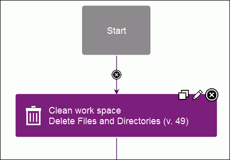

# Lesson 2: Create a component process

Component processes are user-defined tasks that operate on components.

A component process is a succession of commands that are called steps. Steps can manipulate files, run system commands, set properties, pass information to other steps, and run programs. Steps are provided by automation plug-ins. Processes are designed with the drag-and-drop process editor where you drag plug-in steps onto the design editor and configure them as you go. Several plug-ins come with the product and others are available, which work with many different types of software. In this tutorial, you use two plug-ins, both of which come with the product: **FileUtils** and **IBM UrbanCode Deploy**. A component can have any number of processes defined for it, but a component must have at least one process.

In this lesson, you create a deployment process for the helloWorld component. Later, you create an application process that uses the component process to deploy the component.

To create the component process:

1.  Define the component process: 

    1.   On the "Component: helloWorld" page, click the **Processes** tab, and then click **Create Process**. 
    2.   In the Create Process window, type helloProcess in the **Name** field. 
    3.  In the **Process Type** list, select **Deployment**. This list has other options for processes that uninstall or configure components.
    4.   Accept the default values for the other fields, and click **Save**. The **Default Working Directory** field becomes the folder that the agent uses to do its work, such as downloading artifacts and creating temporary files. For the tutorial, the value becomes \\agent\_install\\var\\work\\helloWorld.
    The process is listed on the Processes pane.

2.  From the list of processes, select **helloProcess**. The process opens in the process editor. The process editor lists plug-ins and steps. The required **Start** and **Finish** steps represent the beginning and the end of the process and are automatically placed on the design area. You add steps to the process by dragging them onto the design area and arranging them between the **Start** and **Finish** steps.

    

3.  Add a step that removes files from the working directory. To ensure that the agent works with the most recent files, remove files that remain from previous work:

    1.   In the **Step Palette** pane, click **Utilities**. 
    2.   Click and drag the **Delete Files and Directories** step to the process editor. Click the edit properties icon , and the Edit Properties window opens, showing the properties for the step. Some of these properties are unique to the step, and others are the same for all steps.
    3.  In the **Name** field, specify a name, for example, Clean work space. 
    4.  In the **Base Directory** field, specify a single period \(`.`\).This value resolves to the folder that you specified as the agent working directory.
    5.   Click the **Include** field, and in the Edit Text box, specify an asterisk \(`*`\); then, click **Save**. This parameter instructs the agent to remove all files in the working directory.
    6.   Accept the default values for the other properties, and then click **OK**. 
    The new step is displayed in the design area. Each step has two icons at the upper-right corner of the step. Click the **Edit** icon  to reopen the Edit Properties window where you can modify the step properties. Click the **X** icon  to delete the step and connections to or from it.

    

    The **Start** and **Finish** steps are automatically connected to the step.

4.   If the process step became disconnected from the **Start** and **Finish** steps, connect the **Start** step to the **Clean work space** step. Beginning with **Start**, the connections between steps determine the process flow. You can define connections as you place steps or later. 
5.  Add a step to download the latest version of the component artifacts from the CodeStation repository.The **Download Artifacts** step is used in most deployment-type processes. This step downloads the specified version of the component artifacts to the agent's recently cleaned working directory. When you run the process, specify which version of the component artifacts to use.
    1.   Click **Repositories**, and under **Artifact/IBM UrbanCode Deploy** drag the **Download Artifacts** step to the process editor. Be sure to highlight the connection arrow when you drag the step to the process editor so that connection arrows are automatically inserted from the previous step to the Finish step. See the highlighted connection arrow in this illustration:  
    2.   Click the **Edit** icon , and in the Edit Properties window, accept the default values; then, click **OK**. 
    3.   If you didn't highlight the connection arrow when you dragged the step to the editor, complete these steps: 

        1.  Delete the connection arrow between the **Clean work space** step and the **Finish** step.
        2.  Draw a connection from the **Clean work space** step to the **Download Artifacts** step, and then connect the **Download Artifacts** step to the **Finish** step.
        **Tip:** To manually connect steps, move the mouse over one step. The arrow icon is displayed, as the following figure shows. You use this icon to connect steps to one another.

        

        . Click and drag the arrow icon over the subsequent step. The direction of the arrow defines the direction of the process flow.

        Except for connections from **Start**, each connection has a conditional flag. The conditional flag represents the process status that is required before the connection can be followed. The connection is followed only if the originating step is complete, and the specified condition is met. The possible conditions are as follows: success, failure, or either. The default condition is success, which is represented by a green check mark, as the following figure shows. In this example, the **Download Artifacts** step is started only if the **Clean work space** step finishes with a success condition. You can change the conditional flag by clicking the icon.

        

6.  Add a step to create a compressed file.In this example, the compressed file contains the files that were downloaded in the previous step.
    1.   Click **Utilities**, and under **FileUtils**, drag a **Create .zip File** step to the process editor. 
    2.   In the Edit Properties window, specify the name: Compress artifacts. \(To open the Edit Properties window, the click the **Edit** icon .\) 
    3.  In the **.zip File Name** field, type helloWorld.zip.
    4.  In the **Base Directory** field, type a single period \(`.`\). The compressed file is created in the agent working directory.

        **Note:** If you specify the final destination directory instead of the agent working directory, the following step would be unnecessary. However, in addition to moving the file, the following step demonstrates how to use the property that you created earlier.

    5.   In the text editor that opens for the **Include** field, type an asterisk \(`*`\); then, click **Save**. The compressed file contains all the files that were downloaded from the repository.
    6.   Accept the default values in the other fields, and click **OK**. 
    7.   Verify that there is a connection from the **Download Artifacts** step to the **Compress artifacts** step. If the steps are not connected, manually connect them. 
7.  Add a step to move the artifacts.This step moves the compressed file to the target folder. For simplicity, the tutorial moves the file to a directory in the \\helloWorld folder.
    1.   Expand **Utilities**, and under **FileUtils**, drag a **Move Directory** step to the process editor. 
    2.  In the Edit Properties window, specify the name Deploy artifacts. 
    3.  In the **Source Directory** field, type a single period \(`.`\).
    4.   In the **Destination Directory** field, type the following value: `${p:helloHome}/target`. The `${p:helloHome}` value refers to the property that you created earlier. The /target directory is relative to the property value. If, for example, you defined the property value as /home/user1/artifacts/shared/helloWorld, the file is moved to /home/user1/artifacts/shared/helloWorld/target. For information about using properties, see [Properties](../../com.ibm.udeploy.doc/topics/ud_properties_overview.md).
    5.   In the text box that opens for the **Include Files** field, type: `*.zip`; then, click **Save**. 
    6.   Accept the default values in the other fields, and click **OK**. 
    7.   Verify that there is a connection from the **Compress artifacts** step to the **Deploy artifacts** step. 
8.   Verify that there is a connection from the **Deploy artifacts** step to the **Finish** step. 
9.   Save the process by clicking **Save** . 

The complete process for the helloWorld component looks like the following figure:

In this lesson, you created a component process to deploy the helloWorld component.

You can use component processes to automate many tasks on components. Later in this tutorial, you create an application process to deploy the component.

**Parent topic:** [Create a simple helloWorld deployment](../../com.ibm.udeploy.tutorial.doc/topics/quickstart_abstract.md)

